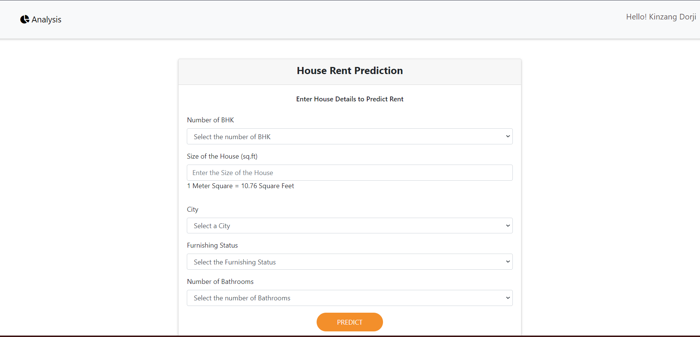
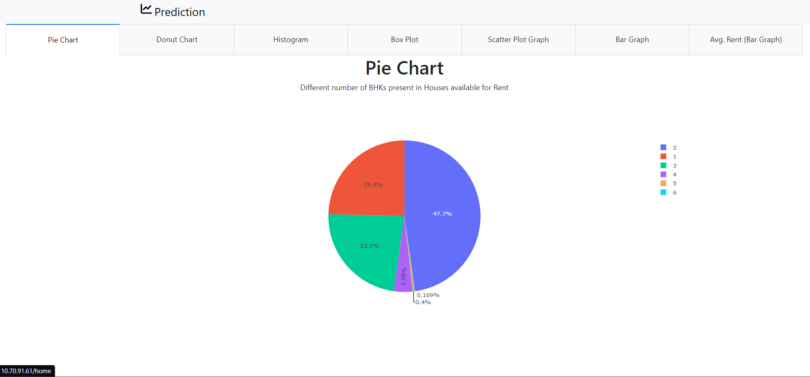

# House Rent Price Prediction :houses:
###### Urbanization has become very common in developing as well as developed countries whereby people migrate from rural to urban areas in search of brighter social as well as economic feasibility such as better education, good health care, proper sanitation, comfortable housing, immense business opportunities and versatile transportation.However, there are problems associated with urbanization. One of them is finding a place to live in. With the increase in the number of people moving from rural to urban, people are having a difficult time finding an affordable place to live in. Taking advantage of the situation, house owners are increasing the house rent and people, in their desperation, have no choice but to stay in houses with rents that are above their pay grade. In order to prevent people from being scammed, there is a need for a system which can predict the rent of houses based on features which can help people know the approved rent of houses. 
## Website Link :link:
[_Visit Our Website_](http://10.70.91.61/) :yellow_heart:
## Status of the Project :telescope:
* Our team have completed working on House Rent Price Prediction.

## Languages and Tools used
<p align="center">
  <a href="https://skillicons.dev">
    
  </a>
</p>


## Overview of the Project
* Registration and Login Page


* Predict the House Rent 


* Visualization and Analysis of Data :bar_chart:



## Required Dependencies
> __Install the Following Dependencies__
```
ansi2html==1.8.0
appnope==0.1.3
asgiref==3.7.2
asttokens==2.2.1
attrs==23.1.0
backcall==0.2.0
backports.zoneinfo==0.2.1
category-encoders==2.6.1
certifi==2023.7.22
charset-normalizer==3.2.0
click==8.1.6
cloudpickle==2.2.1
comm==0.1.3
contourpy==1.1.0
cycler==0.11.0
Cython==3.0.0
dash==2.11.1
dash-core-components==2.0.0
dash-html-components==2.0.0
dash-table==5.0.0
debugpy==1.6.7
decorator==5.1.1
Deprecated==1.2.14
deprecation==2.1.0
Django==4.0.10
django-cors-headers==4.1.0
django-crispy-forms==2.0
django-mongodb-engine==0.6.0
django-mongoengine==0.5.4
djangorestframework==3.14.0
djangotoolbox==1.8.0
djongo==1.3.6
dnspython==2.3.0
executing==1.2.0
fastjsonschema==2.18.0
Flask==2.2.5
fonttools==4.41.1
idna==3.4
imbalanced-learn==0.11.0
importlib-metadata==6.8.0
importlib-resources==6.0.0
ipykernel==6.25.0
ipython==8.12.2
ipywidgets==8.0.7
itsdangerous==2.1.2
jedi==0.18.2
Jinja2==3.1.2
joblib==1.3.1
jsonschema==4.18.4
jsonschema-specifications==2023.7.1
jupyter_client==8.3.0
jupyter_core==5.3.1
jupyterlab-widgets==3.0.8
kaleido==0.2.1
kiwisolver==1.4.4
lightgbm==3.2.1
llvmlite==0.40.1
MarkupSafe==2.1.3
matplotlib==3.7.2
matplotlib-inline==0.1.6
mongoengine==0.27.0
nbformat==5.9.1
nest-asyncio==1.5.6
numba==0.57.1
numpy==1.22.4
orjson==3.9.2
packaging==23.1
pandas==1.5.3
parso==0.8.3
patsy==0.5.3
pexpect==4.8.0
pickleshare==0.7.5
Pillow==10.0.0
pkgutil_resolve_name==1.3.10
platformdirs==3.9.1
plotly==5.15.0
plotly-resampler==0.9.1
pmdarima==2.0.3
prompt-toolkit==3.0.39
psutil==5.9.5
ptyprocess==0.7.0
pure-eval==0.2.2
pycaret==3.0.4
Pygments==2.15.1
pymongo==3.12.3
pyod==1.1.0
pyparsing==3.0.9
python-dateutil==2.8.2
pytz==2023.3
pyzmq==25.1.0
referencing==0.30.0
requests==2.31.0
retrying==1.3.4
rpds-py==0.9.2
schemdraw==0.15
scikit-base==0.5.0
scikit-learn==1.2.2
scikit-plot==0.3.7
scipy==1.10.1
six==1.16.0
sktime==0.21.0
sqlparse==0.2.4
stack-data==0.6.2
statsmodels==0.14.0
tbats==1.1.3
tenacity==8.2.2
threadpoolctl==3.2.0
tornado==6.3.2
tqdm==4.65.0
trace-updater==0.0.9.1
traitlets==5.9.0
tsdownsample==0.1.2
typing_extensions==4.7.1
tzdata==2023.3
urllib3==2.0.4
wcwidth==0.2.6
Werkzeug==2.2.3
widgetsnbextension==4.0.8
wrapt==1.15.0
wurlitzer==3.0.3
xxhash==3.2.0
yellowbrick==1.5
zipp==3.16.2
Pandas==1.5.3
NumPy==1.22.4
sklearn
scikit-learn==1.2.2
```
## Cloning the Project
> You can clone the Project's Remote Repository by
 ```
git clone <remote-repo-url> 
```
> Remote Repository Link/url
 ```
https://github.com/damtz/nsb-data-analysis.git 
```

## Setup
> To run this project

```
python manage.py runserver
```

## Our Team :point_down:
* [Tshering Duba](https://github.com/TsheringDuba23) 
* [Kinzang Dorji](https://github.com/kinzangdorji-2000)
* [Damber Singh Subedi](https://github.com/damtz)
* [Saraswati Acharja](https://github.com/Saraswati-2000)
* [Pema Zangmo](https://github.com/pemazangmo21)
* [Karma Choden](https://github.com/kc-ch)


